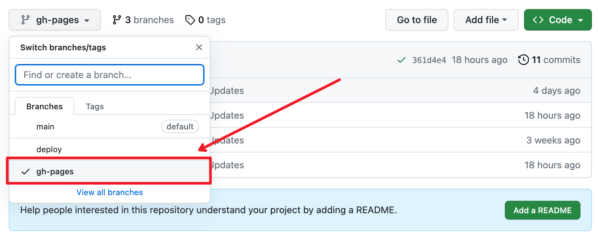
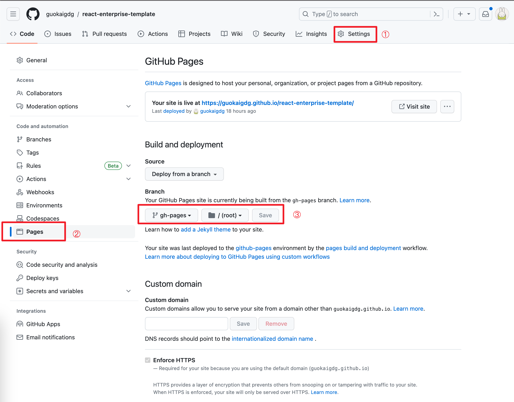

<h1 align="center">Github-Pages 部署</h1>

## 拥有一个前端项目
- 方法一: [React 模板](https://github.com/guokaigdg/react-enterprise-template) 创建项目 (推荐)
- 方法二: create-react-app 创建了项目


## 安装 gh-pages
```
npm install gh-pages --save-dev
```

## 修改 package.json

```js
{
    "homepage": "./react-enterprise-template", // 根据自己项目路径配置, 例如 "./",  "./react-enterprise-template"
    "scripts": {
        // ...
        "deploy": "gh-pages -d build"
    },
}
```

## 部署
### 方法一: 
```
// 编译
npm run build
// 部署
npm run deploy
```
### 方法二:
- 把方法一合并成一句, 修改 package.json
```
"scripts": {
    "deploy": "npm run build && gh-pages -d build"
},
```

### 部署完成之后, 项目出了一个gh-pages分支, 此分支存放的是部署代码




## Setting Pages

### 设置完成点击生成链接查看

- 如图 Your site is live at https://guokaigdg.github.io/react-enterprise-template/



